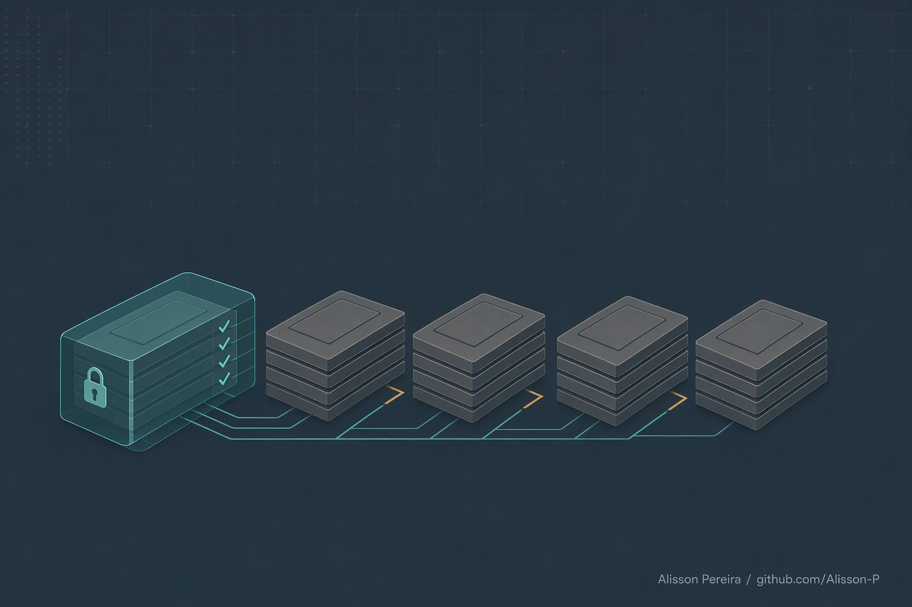
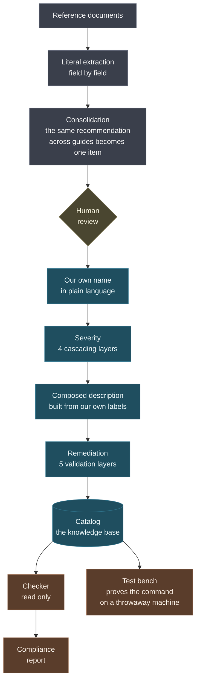

# Hardening Engine

### A hardening baseline of my own, and a checker that would rather say "I don't know" than accuse wrongly

**English** · [Português](README.pt-BR.md) | [JEV variant](https://github.com/Alisson-P/hardening-engine-jev)

> A report that accuses wrongly once loses the standing to accuse rightly next
> time.

A system hardening guide is written for an auditor, not for the person running
the machine. The item name arrives as an acronym, severity is either missing or
measuring something else, and the command that fixes it sits buried inside a
thirty line script.

This project takes that raw material and produces something else: a baseline of
my own, where every item has a name in plain language, a severity decided by an
explicit rule, a description a non technical person understands, a validated
remediation command, and a checker that reads the machine without ever writing
to it.

<p align="center">
  
</p>

---

## The problem

Here is a real item from a reference guide. This is its name:

```
Ensure atm kernel module is not available
```

If you are not in the field, that says nothing. If you are, you still have to
stop and recall what `atm` does. And it goes like that for thousands of items.

Add three things that repeat across practically every guide:

**Severity is not there, or it measures something else.** Several documents
carry a profile level that looks like severity and is not: it measures the
operational impact of applying the setting, not the size of the damage from not
having applied it. "Link appears underlined" and "credential theft from memory"
come out at the same level.

**The fix command is not ready to run.** It sits inside a script example, broken
by the PDF pagination, mixed in with the command that only reads.

**Nobody knows whether the command works.** It is written there, and that is it.

The practical result is that the person who needs to harden an image opens the
guide, reads three hundred pages, and still has no actionable list.

---

## The core idea

Every item has three layers, and they are not the same thing.

| Layer | Illustrative example | Whose it is |
|---|---|---|
| **Ours** | `IDA-0084`, "Local account without a password only logs in at the console", critical | written here |
| **Technical fact** | the configuration key and the value it should hold | public vendor documentation |
| **Expression** | the literal English title and the section number | belongs to whoever published the document |

The configuration key is a fact. No security guide invented it, they recommended
it. The title and the section number, on the other hand, are someone's writing.

**The baseline keeps the first two and discards the third.** Not as a formality:
key plus section number, repeated across thousands of items, builds a navigable
index that replaces consulting the original document. Citing a source is one
thing, replacing it is another.

That separation is what lets me use the baseline freely, and what allows the
engine to take in any other source later.

---

## How it works



The cut is at the human review. Before it, everything is derived from the
document that was read. After it, it is my own analysis.

### Severity in four layers

Since the document's own level does not serve, severity is decided here, in a
cascade. The first layer that answers is the one that decides: the technical
text, then the effect our own name describes, then the floor of the domain.

The correction that changed the result the most was reading **only the
consequence excerpt** of the text, not the whole paragraph. A rationale
paragraph cites threat, history and context, and reading all of it makes almost
every item look severe. Reading only the sentence that says what happens if it
is missing, coverage drops and precision rises considerably.

Less coverage, better result. The next layer picks up the rest.

### The description is not written freehand

It is assembled from two labels of our own: the form of verification and the
reason for the severity.

```
Checks a setting stored in the system's internal configuration.
Without it, you can log in without presenting any password.
Recommended by 3 different guides.
```

That makes it regenerable, consistent across similar items, and independent of
anyone else's wording. The requirement I set for myself was simple: vocabulary a
non technical person understands.

### The checker has four answers, not two

Compliant, non compliant, not applicable, and **could not be checked**.

The fourth exists because accusing a machine over a limitation of the tool
itself is the costliest mistake a checker can make. Whoever receives the report
verifies two findings, sees they do not hold, and starts ignoring the real ones,
including the correct ones.

That is why the compliance score uses **only what was actually checked**.
Whatever could not be read stays out of the count instead of counting as a pass.

### Whoever checks does not write

The checker runs on a list of what it **may** do, not of what it may not.
Denying what is dangerous requires foreseeing every danger; allowing what is
known requires only knowing what you use.

Chaining brings down the whole line, and the fix command never goes anywhere
near the checker: it lives in a different column of the baseline.

### The bench proves the command

A command written in a document is a promise. The bench runs a four step cycle
on a throwaway machine:

1. **break it**, putting the machine in a state that violates the criterion
2. **check**, and the audit has to flag it here
3. **fix**, running the command
4. **check**, and now the audit has to pass

Step 2 is what makes the bench worth anything. Without it, an audit that answers
"compliant" to everything would pass the test without ever having verified a
thing.

---

## Tools

| Tool | What for |
|---|---|
| Python | the whole engine, no external dependency to use the baseline |
| SQLite | local baseline, single file, rebuildable at any time |
| Docker | Linux bench, throwaway container with a service manager |
| PowerShell | Windows bench and provisioning of the test machine |
| Azure | throwaway virtual machine, off domain, no public address |
| Markdown and JSON | the catalog ships in both: one to read, one for the machine |

---

## Some numbers

| | |
|---|---:|
| Reference documents read | 27 |
| Controls extracted | 4,886 |
| Items after consolidation | 2,756 |
| Domains | 17 |
| Items with our own name, severity and description | 2,756 |
| Severity decision layers | 4 |
| Command validation layers | 5 |
| Items the checker verifies on its own | 721 |
| Bench cases ready | 716 |

And the caveats, because they travel with the numbers:

A portion of the items received severity from the domain floor alone, with no
signal of their own in the text or in the name. It is not wrong, but it is
weaker than the rest, and every item records which layer decided for it,
precisely so that difference stays visible instead of disappearing into the
table.

And the stage of building images that are born compliant, which is where the
project is headed, has not started yet.

---

## What this preview shows, and what it does not

**It shows:** the design of the engine, the reasoning behind each decision, the
structure of the baseline and the numbers.

**It does not show:** the code, the full catalog, the usage and architecture
guides, the bench and the checker. All of that lives in the private repository
`hardening-engine-core`.

The examples cited here are illustrative. No data from a real environment, a
client or an assessed machine appears in this preview, and none would: the
project does not collect any of that.

If you would like to see the full content, get in touch.

---

## About

I am Alisson Pereira, I work with cloud security. I built this because I needed
to harden images and got tired of translating auditor guides every time.

The decision that organizes the whole project is the separation between the
technical fact, which is public, and the expression of whoever wrote the
document, which is not mine to redistribute. The engine is not tied to any
source: any reference guide, vendor baseline or internal practice comes in
without changing code.

[github.com/Alisson-P](https://github.com/Alisson-P)

---

## License

This preview is licensed under [CC BY-NC-ND 4.0](https://creativecommons.org/licenses/by-nc-nd/4.0/).

You may share it with credit. You may not use it commercially nor distribute a
modified version.
