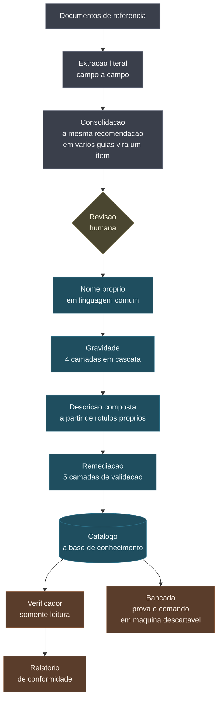

# Hardening Engine

### Uma base própria de endurecimento de sistemas, e um verificador que prefere dizer "não sei" a acusar errado

[English](README.md) · **Português**

> Um relatório que acusa errado uma vez perde a autoridade de acusar certo nas
> próximas.

Guia de endurecimento de sistema é escrito para auditor, não para quem opera.
O nome do item vem como sigla, a gravidade ou não existe ou mede outra coisa, e
o comando que resolve está enterrado no meio de um script de trinta linhas.

Este projeto pega essa matéria bruta e produz outra coisa: uma base própria,
onde cada item tem nome em linguagem comum, gravidade decidida por critério
explícito, descrição que uma pessoa não técnica entende, comando de correção
validado, e um verificador que lê a máquina sem nunca escrever nela.

<p align="center">
  
</p>

---

## O problema

Peguei um item real de um guia de referência. O nome dele é este:

```
Ensure atm kernel module is not available
```

Se você não é da área, isso não diz nada. Se é, ainda precisa parar para
lembrar o que `atm` faz. E é assim com milhares de itens.

Some a isso três coisas que se repetem em praticamente todo guia:

**A gravidade não está lá, ou mede outra coisa.** Vários documentos trazem um
nível de perfil que parece gravidade e não é: ele mede o impacto operacional de
aplicar o ajuste, não o tamanho do estrago de não ter aplicado. "Link aparece
sublinhado" e "roubo de credencial em memória" saem no mesmo nível.

**O comando de correção não está pronto.** Está no meio de um exemplo de
script, quebrado pela paginação do PDF, misturado com o comando que só lê.

**Ninguém sabe se o comando funciona.** Ele está escrito ali, e é isso.

O resultado prático é que a pessoa que precisa endurecer uma imagem abre o
guia, lê trezentas páginas, e ainda assim não tem uma lista acionável.

---

## A ideia central

Todo item tem três camadas, e elas não são a mesma coisa.

| Camada | Exemplo ilustrativo | De quem é |
|---|---|---|
| **Nosso** | `IDA-0084`, "Conta local sem senha só entra pelo console", critical | escrito aqui |
| **Fato técnico** | a chave de configuração e o valor que ela deve ter | documentação pública do fabricante |
| **Expressão** | o título literal em inglês e o número da seção | de quem publicou o documento |

A chave de configuração é fato. Nenhum guia de segurança a inventou, eles a
recomendaram. Já o título e o número da seção são redação de alguém.

**A base guarda as duas primeiras e descarta a terceira.** Não por formalidade:
chave mais número de seção, repetido por milhares de itens, monta um índice
navegável que substitui a consulta ao documento original. Citar a fonte é uma
coisa, substituí-la é outra.

Essa separação é o que me deixa usar a base livremente, e é o que permite que o
motor receba qualquer outra fonte depois.

---

## Como funciona



O corte está na revisão humana. Antes dela, tudo é derivado do documento lido.
Depois dela, é análise própria.

### A gravidade em quatro camadas

Como o nível do documento não serve, a gravidade é decidida aqui, em cascata.
A primeira camada que responde é a que decide: o texto técnico, depois o efeito
que o nome próprio descreve, depois o piso do domínio.

A correção que mais mudou o resultado foi ler **só o recorte de consequência**
do texto, e não o parágrafo inteiro. Parágrafo de justificativa cita ameaça,
histórico e contexto, e lendo tudo quase todo item parece grave. Lendo só a
frase que diz o que acontece se faltar, a cobertura cai e a precisão sobe
bastante.

Menos cobertura, resultado melhor. A camada seguinte pega o resto.

### A descrição não é escrita solta

Ela é montada a partir de dois rótulos nossos: a forma de verificação e o
motivo da gravidade.

```
Confere um ajuste gravado na configuração interna do sistema.
Sem isso, dá para entrar sem apresentar senha nenhuma.
Recomendado por 3 guias diferentes.
```

Isso a torna regenerável, consistente entre itens parecidos, e independente da
redação de terceiros. O pedido que fiz para mim mesmo foi simples: vocabulário
que uma pessoa não técnica entenda.

### O verificador tem quatro respostas, não duas

Em conformidade, fora de conformidade, não se aplica, e **não foi possível
conferir**.

A quarta existe porque acusar uma máquina por limitação da própria ferramenta é
o erro mais caro que um verificador pode cometer. Quem recebe o relatório
confere dois achados, vê que não procedem, e passa a ignorar os verdadeiros,
inclusive os certos.

Por isso a nota de conformidade usa **só o que foi conferido de fato**. O que
não deu para ler fica de fora da conta, em vez de contar como acerto.

### Quem verifica não escreve

O verificador roda com lista do que **pode**, não do que não pode. Negar o
perigoso exige prever todo perigo; permitir o conhecido exige só conhecer o que
se usa.

Encadeamento derruba a linha inteira, e o comando de correção nunca chega perto
do verificador: ele mora em outra coluna da base.

### A bancada prova o comando

Comando escrito num documento é promessa. A bancada roda um ciclo de quatro
passos em máquina descartável:

1. **sujar**, pondo a máquina num estado que viola o critério
2. **conferir**, e a auditoria precisa acusar aqui
3. **corrigir**, rodando o comando
4. **conferir**, e agora a auditoria precisa passar

O passo 2 é o que faz a bancada valer alguma coisa. Sem ele, uma auditoria que
responde "conforme" para qualquer coisa passaria no teste sem nunca ter
verificado nada.

---

## Ferramentas

| Ferramenta | Para que |
|---|---|
| Python | motor inteiro, sem dependência externa para usar a base |
| SQLite | base local, arquivo único, reconstruível a qualquer momento |
| Docker | bancada Linux, container descartável com gerenciador de serviços |
| PowerShell | bancada Windows e provisionamento da máquina de teste |
| Azure | máquina virtual descartável, fora de domínio, sem endereço público |
| Markdown e JSON | o catálogo sai nos dois: um para ler, outro para a máquina |

---

## Alguns números

| | |
|---|---:|
| Documentos de referência lidos | 27 |
| Controles extraídos | 4.886 |
| Itens depois da consolidação | 2.756 |
| Domínios | 17 |
| Itens com nome, gravidade e descrição próprios | 2.756 |
| Camadas de decisão da gravidade | 4 |
| Camadas de validação do comando | 5 |
| Itens que o verificador confere sozinho | 721 |
| Casos de bancada prontos | 716 |

E as ressalvas, porque elas viajam junto com os números:

Uma parte dos itens recebeu gravidade só pelo piso do domínio, sem sinal
próprio no texto nem no nome. Não está errado, mas é mais fraco que o resto, e
cada item guarda qual camada decidiu por ele, justamente para que essa
diferença fique visível em vez de sumir na tabela.

E a etapa de construir imagens que já nascem em conformidade, que é o destino
do projeto, ainda não começou.

---

## O que esta prévia mostra, e o que não mostra

**Mostra:** o desenho do motor, o raciocínio por trás de cada decisão, a
estrutura da base e os números.

**Não mostra:** o código, o catálogo completo, os guias de uso e de arquitetura,
a bancada e o verificador. Isso tudo fica no repositório privado
`hardening-engine-core`.

Os exemplos citados aqui são ilustrativos. Nenhum dado de ambiente real, de
cliente ou de máquina avaliada aparece nesta prévia, nem apareceria: o projeto
não coleta nada disso.

Se você quiser ver o conteúdo completo, me chame.

---

## Sobre

Sou Alisson Pereira, trabalho com segurança em nuvem. Construí isto porque
precisava endurecer imagens e cansei de traduzir guia de auditor toda vez.

A decisão que organiza o projeto inteiro é a separação entre o fato técnico,
que é público, e a expressão de quem escreveu o documento, que não é minha para
redistribuir. O motor não está preso a fonte nenhuma: qualquer guia de
referência, baseline de fabricante ou prática interna entra sem alterar código.

[github.com/Alisson-P](https://github.com/Alisson-P)

---

## Licença

Esta prévia está sob [CC BY-NC-ND 4.0](https://creativecommons.org/licenses/by-nc-nd/4.0/deed.pt-BR).

Você pode compartilhar dando crédito. Não pode usar comercialmente nem
distribuir versão modificada.
